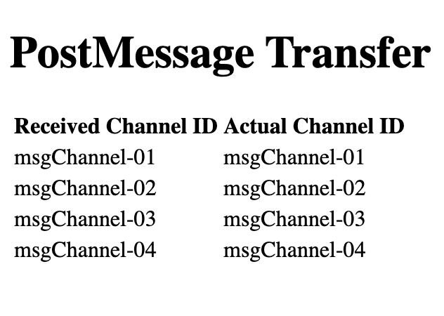
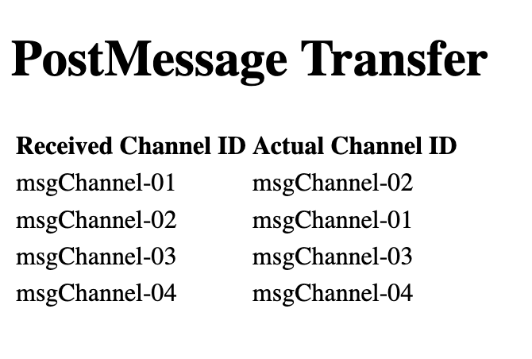

# Problem Statement
Through PostMessage, Web Browsers provide a way to "transfer" certain special objects across windows (ie: iframes, web workers, etc).

Here's the signature of the postMessage method, via the official MDN docs:

```
targetWindow.postMessage(message, targetOrigin, [transfer]);
```

It appears as though, in Firefox, the ordering of the special "transfer" parameter, is not guaranteed!

The problem can be observed when trying to pass multiple MessagePort objects via `window.postMessage()`, in a single call.

Most web applications only need to pass a single object, and thus will not observe the issue.

Related Resources:

- [Post Message Documentation](https://developer.mozilla.org/en-US/docs/Web/API/Window/postMessage)
- [Transferable Documentation](https://developer.mozilla.org/en-US/docs/Web/API/Transferable)

# Demo

This demonstration works by passing multiple MessagePort objects via the "transfer" parameter.

Loading the page (`main.html`), will open an iframe to `iframe.html`.

`main.html` then generates 4 MessageChannel objects, with a unique ID for each.

The MessagePort objects (as instantiated by MessageChannel) are passed by `main.html` to `iframe.html`, along with data that describes the original order they were sent in.

Upon receiving this message, `iframe.html` messages back on each `MessagePort` object, providing the ID that it *should* have been.

`main.html` receives these messages, and stores the results in the on-page table, so the differences can be observed.

## Chrome Result


## Firefox Result


# Install / Start Server
```
npm install
node server.js
```

# Open Site in Firefox
Open `http://localhost:8011/main.html` in Firefox

The results are shown in the on-page table. Reloading the page will cause it to go through the process again, and generate new results.
